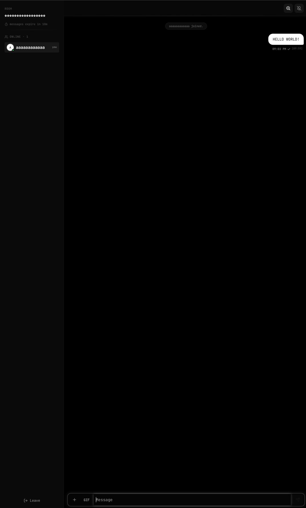

# V0ID Chat

A minimalist, account-free, ephemeral chat application. No sign-ups, no tracking, no data retention. Built for privacy and optimized for low-spec hardware.

**[Live →](https://v0id-chat.lovable.app)**

---

## Preview

| Join Screen | Chat View |
|:-----------:|:---------:|
|  |  |

---

## Features

- **No trace.** Messages, images, files — everything wipes after 10 minutes. No accounts, no logs.
- **Full chat UX.** Real-time chat, typing indicators, read receipts, edit/unsend, threads, and reactions.
- **Media support.** Drag & drop attachments, image previewing, and built-in b/w Klipy GIF search.
- **Void Aesthetic.** Strictly b/w design. Native dark mode, adjustable UI scale, and interactive 404 galaxy background.
- **Admin Terminal.** Type `/admin` to freeze chat, nuke the room, kick users, or broadcast messages.
- **Anti-screenshot.** Room instantly alerts if someone screenshots the chat on mobile.

---

## Tech Stack

| Layer | Technology |
|-------|-----------|
| Frontend | React, TypeScript, Vite |
| Styling | Tailwind CSS, shadcn/ui |
| Animation | Framer Motion |
| Realtime | Supabase Realtime (WebSocket) |
| Storage | Supabase Storage (auto-purged) |
| Backend | Supabase Edge Functions |
| GIFs | Klipy API |

---

## Getting Started

### Development & Contributing

Since V0ID Chat is built on Supabase for real-time features and edge functions, you must link your own Supabase project to run the application locally. All sensitive keys have been removed from this repository.

1. **Clone & Install**
   ```bash
   git clone https://github.com/hypnotized1337/Void-chat.git
   cd Void-chat
   npm install
   ```

2. **Supabase Setup**
   - Create a new project on [Supabase](https://supabase.com).
   - In your Supabase dashboard, locate your Project URL and Anon/Publishable Key.
   - Copy the `.env.example` file and rename it to `.env`.
   - Fill in the variables in `.env` with your project's specific keys:
     ```env
     VITE_SUPABASE_PROJECT_ID="your-project-id"
     VITE_SUPABASE_PUBLISHABLE_KEY="your-anon-key"
     VITE_SUPABASE_URL="https://your-project.supabase.co"
     ```

3. **Link the CLI & Push Database/Functions**
   - Ensure you have the [Supabase CLI](https://supabase.com/docs/guides/cli) installed.
   - Link your local project to your remote Supabase project:
     ```bash
     npx supabase link --project-ref your-project-id
     ```
   - Push the database schemas and deploy the edge functions:
     ```bash
     npx supabase db push
     npx supabase functions deploy
     ```

4. **Run the App**
   ```bash
   npm run dev
   ```

---

## License

MIT
